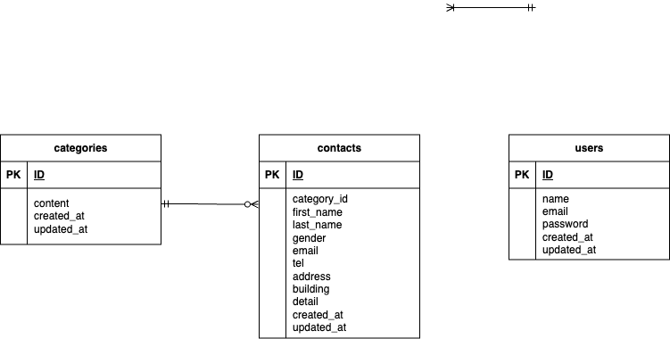

# お問い合わせ管理システム

## 環境構築
**Dockerビルド**
1. リポジトリをクローン
`git clone git@github.com:sara-1003/contact-formtest.git`
2. docker-compose up -d --build

**Laravel環境構築**
1. `docker-compose exec php bash`
2. `composer install`
3. 「.env.example」ファイルから「.env」を作成し、環境変数を変更
4. `php artisan key:generate`
5. `php artisan migrate`
6. `php artisan db:seed`

## 使用技術
- Laravel 8.83.29
- PHP 8.1.33
- MySQL 8.0.26

## ER図

## URL
- 開発環境：http://localhost/
- phpMyAdmin：http://localhost:8080/
